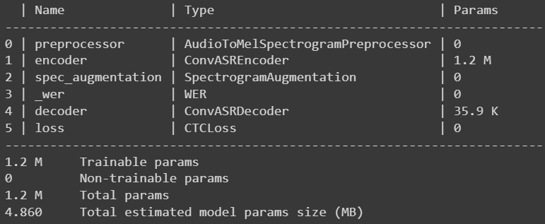
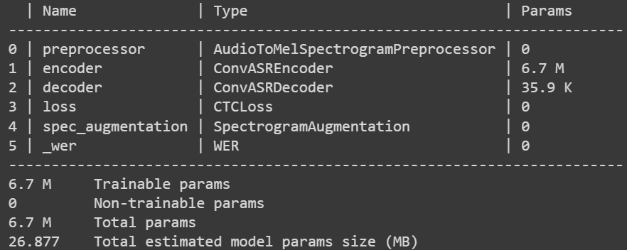

## Turkish Text-to-Speech

### Table Of Contents
- [Custom ASR Data Preperation](#Custom-ASR-Data-Preperation)
- [Download Free Audio Data for ASR](#Download-Free-Audio-Data-for-ASR)
- [Speech Data Augmentation](#Speech-Data-Augmentation)
- [Dataset Configuration](#Dataset-Configuration)
- [Transfer Learning](#Transfer-Learning)
- [Export to ONNX Model](#Export-to-ONNX-Model)
- [Inference](#Inference)
- [Evaluation with Word Error Rate (WER)](#Evaluation-with-Word-Error-Rate-(WER))


### Custom ASR Data Preperation
The `nemo_asr` collection expects each dataset to consist of a set of utterances in individual audio files plus a manifest that describes the dataset, with information about one utterance per line `(.json)`.
Each line of the manifest `(data/train_manifest.jsonl and data/val_manifest.jsonl)` should be in the following format:
```
{"audio_filepath": "/data/train_wav/audio_1.wav", "duration": 2.836326530612245, "text": "bugün hava durumu nasıl"}
```
The `audio_filepath` field should provide an absolute path to the `.wav` file corresponding to the utterance. The `text` field should contain the full transcript for the utterance, and the `duration` field should reflect the duration of the utterance in seconds.

### Download Free Audio Data for ASR
You can download and create `manifest.jsonl` from some of the common publically available speech dataset in **Turkish** and some **other languages** from my reporisitory [speech-datasets-for-ASR](https://github.com/Rumeysakeskin/speech-datasets-for-ASR).

### Speech Data Augmentation
Also, you can use my repository [
speech-data-augmentation](https://github.com/Rumeysakeskin/speech-data-augmentation) to **increase the diversity** of your dataset augmenting the data artificially for ASR models training.

### Dataset Configuration
- [QuartzNet 15x5 model config file](https://catalog.ngc.nvidia.com/orgs/nvidia/models/quartznet_15x5_ls_sp/files) was used that trained only on LibriSpeech.
Turkish labels were configured in `configs/quartznet15x5.yaml` in the following format:
```
labels: &labels [" ", "a", "b", "c", "ç", "d", "e", "f", "g", "ğ", "h", "ı", "i", "j", "k", "l", "m",
         "n", "o", "ö", "p", "q", "r", "s", "ş", "t", "u", "ü", "v", "w", "x", "y", "z", "'"]
```
- Turkish model checkpoint `(pretrained_turkish_model/epoch-99.ckpt)` was used for fine-tuning.

### Transfer Learning
 Pretrained QuartzNet15x5 Parameters | Transfer-learning QuartzNet15x5 Parameters |
 ------- | ------- |
 |   |


Run the following command:
```
python fine_tune.py
```
### Export to ONNX Model
```
export_model.ipynb
```
### Inference
ONNX Runtime works with different hardware acceleration libraries through its extensible Execution Providers (EP) framework to optimally execute the ONNX models on the hardware platform. 
To find the best performance and apply performance-tuning for your model and hardware with [ONNX Runtime](https://onnxruntime.ai/docs/performance/tune-performance.html).
```
python stt_inferencer.py
```
### Evaluation with Word Error Rate (WER)
```
evaluate_model.ipynb
```


